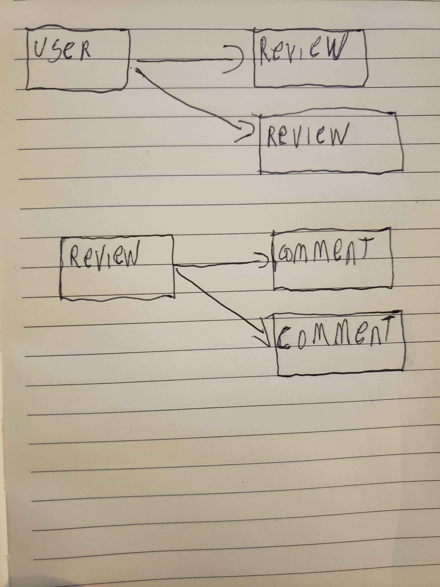

gamebook api

# gamebook-api

Chat Room Project
For my project I created a review application. Once user register and sign in, they are sent into review page where they can add review about a game

REPOS
Deployed Client: https://yourifrancois.github.io/gamebook/#/
Deployed API: https://young-island-85244.herokuapp.com
Client Repo: https://github.com/YouriFrancois/gamebook
API Repo: https://github.com/YouriFrancois/gamebook-api

Technologies
For this project, I utilized JavaScript, Axios, React,Express Bootstrap, HTML and Git.

Development
my development cycle was split into two parts, the first one is the user will be able to create a review for a game thee second part is to be able to save it in the back end and retrieve the comment left in the review the difficult part was the comment when i was pushing to the array it was not saving it.
//\***\*\*\*\*\*\*\***\*\***\*\*\*\*\*\*\***

User Stories
As an unregistered user, I would like to sign up with email and password.
As a registered user, I would like to sign in with email and password.
As a signed in user, I would like to change password.
As a signed in user, I would like to sign out.
As a signed in user, I would create a game review.
As a signed in user in a review, would be able to see all comment in the review.
As a signed in user in a review, would be able to write comment in the review..
As a signed in user in a review, would be able to update his review.
As a signed in user of a review, would be able to delete his review.
Wireframes and ERD
They can be found here,

Routes
Installation (for developers)
Fork & Clone or download zip for development files. Install dependencies with npm install.
npm run server to start the server

//**\*\***\*\*\*\***\*\***\*\*\*\***\*\***\*\*\*\***\*\***

<table>
  <tr>
    <th>Verb</th>
    <th>URI Pattern</th>
  </tr>
  <tr>
    <td>GET</td>
    <td>/status</td>
  </tr>
  <tr>
    <td>GET</td>
    <td>/status/:id</td>
  </tr>
  <tr>
    <td>post</td>
    <td>/status</td>
  </tr>
  <tr>
    <td>PATCH</td>
    <td>/status/:id</td>
  </tr>
  <tr>
    <td>PATCH</td>
    <td>/status-comment/:id</td>
  </tr>
  <tr>
    <td>Delete</td>
    <td>/status/:id</td>
  </tr>

</table>

Planning Updates
Our next version of the application will enable users to CRUD in their comment
